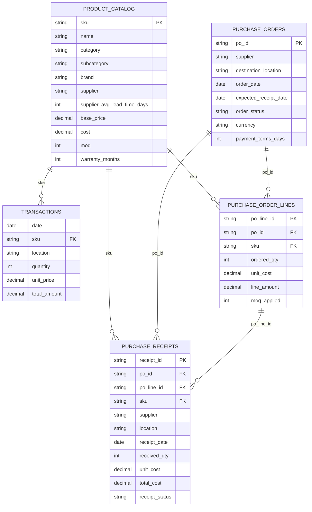

# E/R del Modelo de Datos de `output/`

## Alcance

Este E/R considera las tablas operativas actuales generadas en `output/`:

- `product_catalog.csv`
- `transactions.csv`
- `purchase_orders.csv`
- `purchase_order_lines.csv`
- `purchase_receipts.csv`

`product_metrics.csv` existe todavia en `output/`, pero se considera un artefacto legado y no parte del modelo operacional actual.

## Diagrama E/R



## Lectura del Modelo

### 1. `product_catalog.csv`

Maestro de productos.

Clave primaria:

- `sku`

Rol en el modelo:

- define el producto base
- define proveedor principal
- define costo base y MOQ
- sirve como referencia para ventas y compras

Columnas:

- `sku`
- `name`
- `category`
- `subcategory`
- `brand`
- `supplier`
- `supplier_avg_lead_time_days`
- `base_price`
- `cost`
- `moq`
- `warranty_months`

### 2. `transactions.csv`

Movimientos de salida.
En este proyecto representan demanda consumida o vendida por sucursal.

Clave natural sugerida:

- `date + sku + location`

Relaciones:

- `sku -> product_catalog.sku`

Columnas:

- `date`
- `sku`
- `location`
- `quantity`
- `unit_price`
- `total_amount`

Semantica:

- `transactions` = `salidas`

### 3. `purchase_orders.csv`

Cabecera de orden de compra.
Una OC pertenece a un proveedor y a una sucursal destino.

Clave primaria:

- `po_id`

Relaciones:

- se relaciona con `purchase_order_lines` por `po_id`
- se relaciona con `purchase_receipts` por `po_id`

Columnas:

- `po_id`
- `supplier`
- `destination_location`
- `order_date`
- `expected_receipt_date`
- `order_status`
- `currency`
- `payment_terms_days`

### 4. `purchase_order_lines.csv`

Detalle de cada OC.

Clave primaria:

- `po_line_id`

Claves foraneas:

- `po_id -> purchase_orders.po_id`
- `sku -> product_catalog.sku`

Columnas:

- `po_id`
- `po_line_id`
- `sku`
- `ordered_qty`
- `unit_cost`
- `line_amount`
- `moq_applied`

Nota:

- hoy el generador crea 1 linea por OC, pero el modelo permite varias lineas por OC

### 5. `purchase_receipts.csv`

Entradas efectivas de inventario por recepcion.

Clave primaria:

- `receipt_id`

Claves foraneas:

- `po_id -> purchase_orders.po_id`
- `po_line_id -> purchase_order_lines.po_line_id`
- `sku -> product_catalog.sku`

Columnas:

- `receipt_id`
- `po_id`
- `po_line_id`
- `sku`
- `supplier`
- `location`
- `receipt_date`
- `received_qty`
- `unit_cost`
- `total_cost`
- `receipt_status`

Semantica:

- `purchase_receipts` = `entradas`

## Cardinalidades

- un `producto` puede tener muchas `transactions`
- un `producto` puede aparecer en muchas `purchase_order_lines`
- una `purchase_order` puede tener muchas `purchase_order_lines`
- una `purchase_order_line` puede tener una o varias `purchase_receipts`
- una `purchase_order` puede generar una o varias `purchase_receipts`

## Vista de Negocio

Agrupacion recomendada:

- `transactions.csv` = salidas
- `purchase_receipts.csv` = entradas

Con eso, el flujo operacional queda:

1. el catalogo define producto, proveedor, costo y MOQ
2. las `transactions` representan consumo o venta
3. las `purchase_orders` representan decision de abastecimiento
4. las `purchase_order_lines` detallan que SKU se compra
5. las `purchase_receipts` representan ingreso efectivo de stock

## Relacion Logica de Llaves

```text
product_catalog.sku
    -> transactions.sku
    -> purchase_order_lines.sku
    -> purchase_receipts.sku

purchase_orders.po_id
    -> purchase_order_lines.po_id
    -> purchase_receipts.po_id

purchase_order_lines.po_line_id
    -> purchase_receipts.po_line_id
```

## Nota sobre `product_metrics.csv`

`product_metrics.csv` no forma parte del E/R operacional actual porque:

- no es tabla transaccional ni maestra
- no participa en relaciones de negocio
- el generador actual ya no la vuelve a producir como salida principal

Si quisieras mantenerla, deberia tratarse como tabla derivada o analitica, no como entidad core del modelo.
